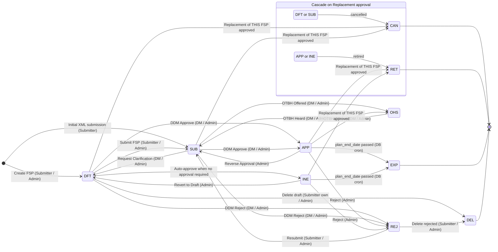

# FSP Status State Machine

Source-of-truth scan:

- **Allowed transitions** — `THE.FSP_COMMON_VALIDATION.validate_status_change`
  (`R__06413_FSP_COMMON_VALIDATION.sql:662-748`). Any transition not listed
  is rejected at the proc layer with `FSP.INVALID.STATUS.UPDATE`.
- **Cascade transitions** — `THE.FSP_COMMON_DB.fsp_status_cancel`
  (`R__06412_FSP_COMMON_DB.sql:2291-2369`), invoked by `fsp_approval` when
  a Replacement (`fsp_amendment_code='RPL'`) hits APP. These bypass
  `validate_status_change` and explicitly set `CAN` / `RET` on sibling
  amendments.
- **Role gating** — `WorkflowDataTab.tsx:135-208` (`enableReviewEdits`,
  `enableOtbhOfferedEdit`, `enableOtbhHeardEdit`, `enableDdmEdit`,
  `enableExtensionEdit`, `canUpdateApproved`). The proc itself doesn't
  enforce role — the SPA gates the UI controls and the JWT roles
  populate the proc-side `p_user_role`.

---

## 1. Statuses that exist in practice

| Code | Description | Notes |
| --- | --- | --- |
| `DFT` | Draft | Editable. Default state of a newly-created amendment (XML actionCode `I`, AMEND / REPLACE proc, fsp_create_new). |
| `SUB` | Submitted | Awaiting ministry decision. Set by the Submit FSP action. |
| `OHS` | Opportunity to be Heard | DDM has offered the submitter a chance to be heard on a submission. Set by SAVE_OTBH_OFFERED. |
| `APP` | Approved | DDM approved; awaiting effective date. |
| `INE` | In Effect | Approved + plan_start_date has arrived. Often reached directly when `approval_required_ind = 'N'` (transitional FSPs). |
| `REJ` | Rejected | DDM rejected the submission. |
| `CAN` | Cancelled | Cascade-only: prior DFT/SUB amendment on the FSP when a Replacement is approved. |
| `RET` | Retired | Cascade-only: prior APP/INE amendment on the FSP when a Replacement is approved. |
| `EXP` | Expired | Set when `plan_end_date` passes. Not user-driven — automatic in the DB. |
| `DEL` | Deleted | Set by hard delete of a DFT or REJ amendment via `FSP_300_INFORMATION.MAINLINE(P_ACTION=REMOVE)`. |

> Operational FSPs spend most of their lifetime as `DFT` → `SUB` → `APP` →
> `INE`. The bottom four (`CAN`, `RET`, `EXP`, `DEL`) are
> end-of-life / superseded states that arrive via cascades or batch
> processes, not direct user action.

---

## 2. Allowed transitions (proc-enforced)

Anything not listed here returns `FSP.INVALID.STATUS.UPDATE`.

| From | To | Direct trigger / proc action | Role(s) that can fire it |
| --- | --- | --- | --- |
| _(none)_ | `DFT` | Create FSP — XML `actionCode=I`, AMEND, REPLACE, or `fsp_create_new` | Submitter, Administrator |
| _(none)_ | `SUB` | Initial submission that skips DFT (rare; some XML paths) | Submitter |
| `DFT` | `SUB` | **Submit FSP** button — `FSP_300_INFORMATION.MAINLINE(SUBMIT)` | Submitter, Administrator |
| `DFT` | `INE` | Auto-approve when `approval_required_ind='N'` (transitional FSPs) | Submitter (via Submit), Administrator |
| `DFT` | `APP` | DDM Approve on a draft (rare path; usually goes through SUB) | Decision Maker, Administrator |
| `DFT` | `REJ` | DDM Reject on a draft | Decision Maker, Administrator |
| `DFT` | `DEL` | Delete draft | Submitter (own FSP), Administrator |
| `SUB` | `DFT` | DDM **Request Clarification** — `SAVE_DDM_DFT(completed='Y')` | Decision Maker, Administrator |
| `SUB` | `APP` | DDM **Approve** — `SAVE_DDM_APP(completed='Y')` | Decision Maker, Administrator |
| `SUB` | `REJ` | DDM **Reject** — `SAVE_DDM_REJ(completed='Y')` | Decision Maker, Administrator |
| `SUB` | `OHS` | **OTBH Offered** — `SAVE_OTBH_OFFERED(completed='Y')` | Decision Maker, Administrator |
| `OHS` | `SUB` | **OTBH Heard** — `SAVE_OTBH_HEARD(completed='Y')` | Decision Maker, Administrator |
| `APP` | `SUB` | **Reverse Approval** — `SAVE_DDM_APP(completed='N')` | Administrator (per `canUpdateApproved` + the new SUB/APP gate on `enableDdmEdit`) |
| `APP` | `REJ` | Reject an approved FSP | Administrator |
| `APP` | `OHS` | OTBH Offered post-approval | Decision Maker, Administrator |
| `INE` | `DFT` | Revert an in-effect FSP back to draft | Administrator |
| `INE` | `REJ` | Reject an in-effect FSP | Administrator |
| `REJ` | `SUB` | Resubmit a rejected FSP | Submitter, Administrator |
| `REJ` | `DEL` | Delete a rejected FSP | Submitter, Administrator |

---

## 3. Cascade transitions (Replacement approval)

When a `RPL` amendment is approved (DDM Approve), `fsp_approval` calls
`fsp_status_cancel` and direct-updates sibling amendments **without**
running `validate_status_change`:

| From (sibling amendment) | To | Trigger |
| --- | --- | --- |
| `DFT`, `SUB` | `CAN` | Replacement approved (fsp_status_cancel inserts `'Cancel Issued'` history rows + updates status). |
| `APP`, `INE` | `RET` | Replacement approved (fsp_status_cancel inserts `'Retired Issued'` history rows + updates status). |

Effectively, approving a Replacement clears the deck on the FSP — every
prior amendment is finalised so only the new replacement is live.

---

## 4. Automatic transition

| From | To | Trigger |
| --- | --- | --- |
| `APP`, `INE` | `EXP` | DB-side / batch process when `plan_end_date < SYSDATE`. Not user-driven. |

---

## 5. Role reference

| Code | Description | What they can drive in this state machine |
| --- | --- | --- |
| `FSPTS_SUBMITTER` | Industry submitter (BCeID) | Create, edit-while-DFT, Submit, Delete-own-DFT. |
| `FSPTS_REVIEWER` | Ministry reviewer (IDIR) | Mark review milestones (FNR/RS/ORS/OTHER) Completed/Pending. No status transitions on their own. |
| `FSPTS_DECISION_MAKER` | Ministry DDM (IDIR) | All SUB→{DFT,APP,REJ,OHS}, OHS→SUB, OTBH Offered on APP, edit DDM Decision in SUB/APP. |
| `FSPTS_ADMINISTRATOR` | System admin (IDIR) | Everything a Decision Maker can do plus reverse-from-APP, INE→{DFT,REJ}, APP→REJ, and the few "admin-only" branches. |
| `FSPTS_VIEW_ALL`, `FSPTS_VIEW_ONLY` | Read-only roles | No transitions. |

---

## 6. State diagram

---

## 7. Quick reference: "When can the user X this FSP?"

| User wants to… | FSP status must be… | Role |
| --- | --- | --- |
| Edit Information tab | `DFT` (anyone) · `APP`, `INE` (Admin) | Submitter (DFT) / Administrator |
| Submit | `DFT` | Submitter, Administrator |
| Delete | `DFT` (UI), `REJ` (proc allows but UI hidden) | Submitter (own), Administrator |
| Amend | `APP` or `INE` + no unapproved amend in flight | Submitter, Administrator |
| Replace | `APP` or `INE` | Submitter, Administrator |
| Extend | `APP` or `INE` | Submitter, Administrator |
| Edit Review milestone (FNR/RS/ORS/OTHER) | `SUB` | Reviewer, Decision Maker, Administrator |
| Edit OTBH Offered | `SUB` (or `INE` via Admin override) | Decision Maker, Administrator |
| Edit OTBH Heard | `OHS` | Decision Maker, Administrator |
| Edit DDM Decision | `SUB` or `APP` | Decision Maker, Administrator |
| Reverse DDM Decision | `APP` (and reverses to SUB) | Administrator |
| Edit Extension Decision | While extension is open (not `APP`/`REJ`) | Decision Maker, Administrator; once APP/REJ → Admin only |
