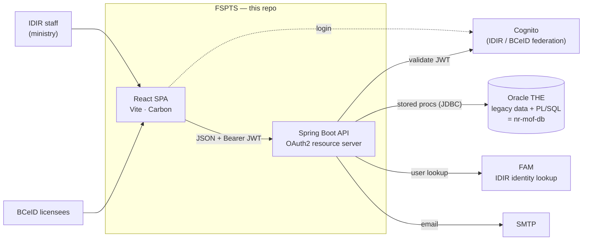
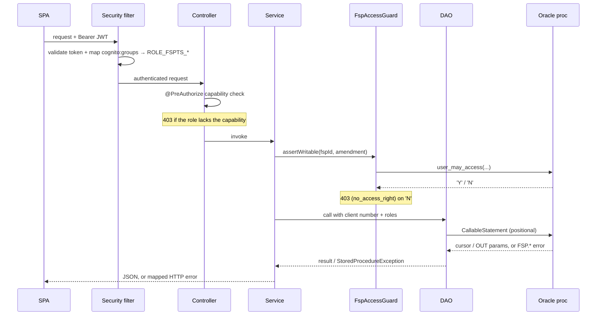

# Architecture

## The one thing to understand first

The backend **does not own its data model.** All FSP data lives in the shared
BC Gov Oracle `THE` schema, and the business logic lives in legacy PL/SQL
packages maintained in a separate repo (`nr-mof-db`). This application is a
modern UI and API layer over those packages — it calls stored procedures and
maps their cursors/INOUT parameters to JSON.

Consequences that shape the whole codebase:

- **Services are thin.** A service method usually validates input, resolves
  the audit user / roles / client number, calls one or more procs via a DAO,
  and maps the result. Business rules (status transitions, validation,
  cascades) belong to the procs.
- **DAOs wrap stored procedures**, not tables. They build positional
  `CallableStatement`s, register OUT cursors, and read results by position.
- **Authorization is layered** — JWT validation, role gates, and a per-FSP
  ownership fence that delegates to the same proc the legacy app used.
- **Errors are proc-driven.** Procs raise `FSP.*` / `fsp.web.error.*` codes;
  the API maps them to HTTP statuses and curated messages.

## System context



Submissions used to arrive over a sixth dependency — the external **ESF** queue
— now replaced by direct upload (see [submissions.md](submissions.md#background-bringing-esf-in-house)).

## Layers

```
                         frontend/  (React SPA)
                              │  fetch + Cognito Bearer token
                              ▼
  endpoint/      interfaces — REST mappings + OpenAPI annotations + @PreAuthorize
       └─ controller/   @RestController impls of those interfaces
              │
  service/     thin orchestration; resolves audit user / roles / client number,
       │       applies the access fence, calls DAOs, maps results
       ▼
  dao/         CallableStatement wrappers around THE.* PL/SQL packages
       │
       ▼
  Oracle THE schema   (legacy data + PL/SQL = nr-mof-db)
```

Supporting packages (`backend/src/main/java/ca/bc/gov/nrs/fsp/api/`):

| Package | Role |
|---------|------|
| `endpoint` | REST interfaces — URL mappings, Swagger docs, and `@PreAuthorize` gates live here |
| `controller` | `@RestController` classes implementing the endpoint interfaces |
| `service` | Orchestration; one service per domain (FSP, Workflow, Standards, Attachments, …) |
| `dao` | Stored-procedure wrappers (`*Dao` interface + `*DaoImpl`); `AbstractStoredProcedureDao` holds shared call plumbing |
| `struct` | Request/response DTOs |
| `security` | Cognito JWT validation, role authorities, the capability matrix (`FspAuthorities`), the ownership fence (`FspAccessGuard`) |
| `submission` | XML / GeoJSON parsing, validation, preview, and persistence — the in-house replacement for the external **ESF** intake ([submissions.md](submissions.md#background-bringing-esf-in-house)) |
| `notification` | Two email flows — transactional workflow events and the scheduled district-designate digest ([notifications.md](notifications.md)) |
| `exception` | Exception → HTTP mapping; `ProcErrorMessages` curates `FSP.*` proc codes |
| `util` | `RequestUtil` — pulls audit user, roles, and active-org client number off the JWT/request |
| `service/v1/report` | JasperReports PDF/CSV generation — **bypasses the DAO layer** and fills templates directly against Oracle; see [reports.md](reports.md) |

## Request flow (a write, end to end)

1. **SPA** calls the API with `Authorization: Bearer <Cognito access token>`.
   `services/apiFetch.ts` attaches the token from the Amplify session.
2. **JWT validation** (`FspSecurityConfig`): signature + issuer + expiry, plus
   two custom validators — the token must be an *access* token, and it must
   carry at least one FSPTS role (`cognito:groups`).
3. **Authorities**: `cognito:groups` → `ROLE_FSPTS_*` (canonical + any
   org-suffixed variant).
4. **Method security**: the endpoint method's `@PreAuthorize` checks a
   capability from `FspAuthorities` (e.g. content edit, workflow decision).
5. **Service**: resolves the audit user / legacy roles / active-org client
   number via `RequestUtil`, calls `FspAccessGuard.assertWritable(...)` to fence
   the FSP by org ownership, then invokes the DAO.
6. **DAO**: builds the positional `CallableStatement`, binds params (including
   `p_user_client_number` / `p_user_role`), executes, and reads the result.
7. **Proc**: enforces business rules; on a violation raises an `FSP.*` /
   `fsp.web.error.*` code.
8. **Error mapping**: a proc error surfaces as `StoredProcedureException`;
   `RestExceptionHandler` + `ProcErrorMessages` map the code to an HTTP status
   (e.g. `no_access_right` → 403) and a curated message.



See [roles-and-security.md](roles-and-security.md) for steps 2–5 and
[database.md](database.md) for steps 6–8.

## Authentication

- Identity is **Cognito**, federating **IDIR** (ministry staff) and **BCeID
  Business** (licensees). The SPA uses AWS Amplify; the API is a stateless
  OAuth2 **resource server** (no sessions).
- Roles are Cognito groups (`FSPTS_ADMINISTRATOR`, `FSPTS_SUBMITTER`, …),
  optionally org-suffixed (`FSPTS_ADMINISTRATOR_DPG`).
- BCeID submitters act on behalf of a forest-client org; the **active-org**
  header carries the client number that scopes their access. See the ownership
  fence in [roles-and-security.md](roles-and-security.md).

## Frontend shape

- **Routing + access** (`src/routes/`): `routePaths.ts` (nav model) and
  `access.ts` (capability predicates) decide what each role sees and can reach.
- **Pages** (`src/pages/`): Search, Inbox, Standards Search, Reports, District
  Notification, Data Submission, Submission History, and the multi-tab FSP
  Information page.
- **Services** (`src/services/`): typed fetch wrappers per domain;
  `apiFetch.ts` centralizes auth + error-body parsing.
- **Context** (`src/context/`): auth, active org, theme, notifications.

## External integrations

The API depends on four BC Gov services:

| System | Used for | Doc |
|--------|----------|-----|
| **Oracle `THE`** | All FSP data + business logic (legacy PL/SQL) | [database.md](database.md) |
| **Cognito** | Authentication (IDIR / BCeID Business JWTs) | [roles-and-security.md](roles-and-security.md) |
| **FAM** | IDIR identity lookup (user picker + digest email resolution) | [fam-integration.md](fam-integration.md) |
| **SMTP** | Outgoing email (workflow events + designate digest) | [notifications.md](notifications.md) |

Submissions used to arrive via a fifth — the external **ESF** queue — now
replaced by direct upload ([submissions.md](submissions.md#background-bringing-esf-in-house)).

## Deployment

OpenShift via GitHub Actions (`.github/workflows/`). The frontend is served by
Caddy (reverse-proxying `/api/*` to the backend Service); the backend runs as a
container connecting to the shared Oracle. Local dev mirrors this with
`compose.yml`.
