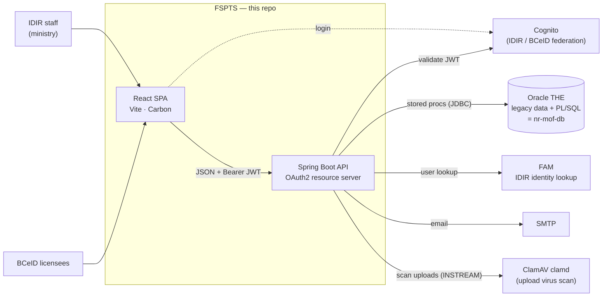
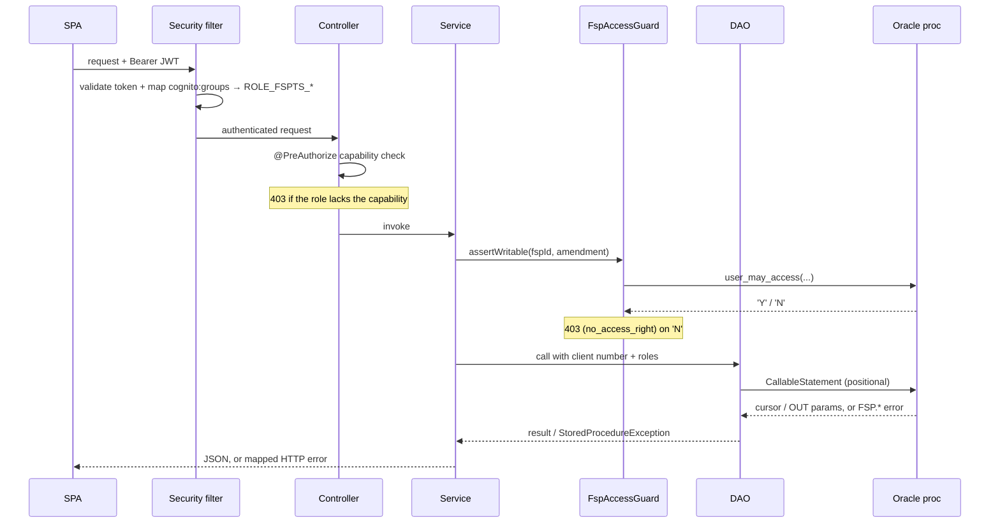

# Architecture

## The one thing to understand first

The backend **does not own its data model.** All FSP data lives in the shared
BC Gov Oracle `THE` schema, and the business logic lives in legacy PL/SQL
packages maintained in a separate repo (`nr-mof-db`). This application is a
modern UI and API layer over those packages — it calls stored procedures and
maps their cursors/INOUT parameters to JSON.

Consequences that shape the whole codebase:

- **Services are thin.** A service method usually validates input, resolves
  the audit user / roles / client number, calls one or more procs via a DAO,
  and maps the result. Business rules (status transitions, validation,
  cascades) belong to the procs.
- **DAOs wrap stored procedures**, not tables. They build positional
  `CallableStatement`s, register OUT cursors, and read results by position.
- **Authorization is layered** — JWT validation, role gates, and a per-FSP
  ownership fence that delegates to the same proc the legacy app used.
- **Errors are proc-driven.** Procs raise `FSP.*` / `fsp.web.error.*` codes;
  the API maps them to HTTP statuses and curated messages.

## System context



Submissions used to arrive over a sixth dependency — the external **ESF** queue
— now replaced by direct upload (see [submissions.md](submissions.md#background-bringing-esf-in-house)).

## Layers

```
                         frontend/  (React SPA)
                              │  fetch + Cognito Bearer token
                              ▼
  endpoint/      interfaces — REST mappings + OpenAPI annotations + @PreAuthorize
       └─ controller/   @RestController impls of those interfaces
              │
  service/     thin orchestration; resolves audit user / roles / client number,
       │       applies the access fence, calls DAOs, maps results
       ▼
  dao/         CallableStatement wrappers around THE.* PL/SQL packages
       │
       ▼
  Oracle THE schema   (legacy data + PL/SQL = nr-mof-db)
```

Supporting packages (`backend/src/main/java/ca/bc/gov/nrs/fsp/api/`):

| Package | Role |
|---------|------|
| `endpoint` | REST interfaces — URL mappings, Swagger docs, and `@PreAuthorize` gates live here |
| `controller` | `@RestController` classes implementing the endpoint interfaces |
| `service` | Orchestration; one service per domain (FSP, Workflow, Standards, Attachments, …) |
| `dao` | Stored-procedure wrappers (`*Dao` interface + `*DaoImpl`); `AbstractStoredProcedureDao` holds shared call plumbing |
| `struct` | Request/response DTOs |
| `security` | Cognito JWT validation, role authorities, the capability matrix (`FspAuthorities`), the ownership fence (`FspAccessGuard`) |
| `submission` | XML / GeoJSON parsing, validation, preview, and persistence — the in-house replacement for the external **ESF** intake ([submissions.md](submissions.md#background-bringing-esf-in-house)) |
| `notification` | Two email flows — transactional workflow events and the scheduled district-designate digest ([notifications.md](notifications.md)) |
| `exception` | Exception → HTTP mapping; `ProcErrorMessages` curates `FSP.*` proc codes |
| `util` | `RequestUtil` — pulls audit user, roles, and active-org client number off the JWT/request |
| `service/v1/report` | JasperReports PDF/CSV generation — **bypasses the DAO layer** and fills templates directly against Oracle; see [reports.md](reports.md) |

## Request flow (a write, end to end)

1. **SPA** calls the API with `Authorization: Bearer <Cognito access token>`.
   `services/apiFetch.ts` attaches the token from the Amplify session.
2. **JWT validation** (`FspSecurityConfig`): signature + issuer + expiry, plus
   two custom validators — the token must be an *access* token, and it must
   carry at least one FSPTS role (`cognito:groups`).
3. **Authorities**: `cognito:groups` → `ROLE_FSPTS_*` (canonical + any
   org-suffixed variant).
4. **Method security**: the endpoint method's `@PreAuthorize` checks a
   capability from `FspAuthorities` (e.g. content edit, workflow decision).
5. **Service**: resolves the audit user / legacy roles / active-org client
   number via `RequestUtil`, calls `FspAccessGuard.assertWritable(...)` to fence
   the FSP by org ownership, then invokes the DAO.
6. **DAO**: builds the positional `CallableStatement`, binds params (including
   `p_user_client_number` / `p_user_role`), executes, and reads the result.
7. **Proc**: enforces business rules; on a violation raises an `FSP.*` /
   `fsp.web.error.*` code.
8. **Error mapping**: a proc error surfaces as `StoredProcedureException`;
   `RestExceptionHandler` + `ProcErrorMessages` map the code to an HTTP status
   (e.g. `no_access_right` → 403) and a curated message.



See [roles-and-security.md](roles-and-security.md) for steps 2–5 and
[database.md](database.md) for steps 6–8.

## Authentication

- Identity is **Cognito**, federating **IDIR** (ministry staff) and **BCeID
  Business** (licensees). The SPA uses AWS Amplify; the API is a stateless
  OAuth2 **resource server** (no sessions).
- Roles are Cognito groups (`FSPTS_ADMINISTRATOR`, `FSPTS_SUBMITTER`, …),
  optionally org-suffixed (`FSPTS_ADMINISTRATOR_DPG`).
- BCeID submitters act on behalf of a forest-client org; the **active-org**
  header carries the client number that scopes their access. See the ownership
  fence in [roles-and-security.md](roles-and-security.md).

## Frontend shape

- **Routing + access** (`src/routes/`): `routePaths.ts` (nav model) and
  `access.ts` (capability predicates) decide what each role sees and can reach.
- **Pages** (`src/pages/`): Search, Inbox, Standards Search, Reports, District
  Notification, Data Submission, Submission History, and the multi-tab FSP
  Information page.
- **Services** (`src/services/`): typed fetch wrappers per domain;
  `apiFetch.ts` centralizes auth + error-body parsing.
- **Context** (`src/context/`): auth, active org, theme, notifications.

## External integrations

The API depends on six BC Gov services:

| System | Used for | Doc |
|--------|----------|-----|
| **Oracle `THE`** | All FSP data + business logic (legacy PL/SQL) | [database.md](database.md) |
| **Cognito** | Authentication (IDIR / BCeID Business JWTs) | [roles-and-security.md](roles-and-security.md) |
| **FAM** | IDIR identity lookup (user picker + digest email resolution) | [fam-integration.md](fam-integration.md) |
| **SMTP** | Outgoing email (workflow events + designate digest) | [notifications.md](notifications.md) |
| **ClamAV** | Virus-scanning every uploaded file (clamd over raw TCP) | [virus-scanning.md](virus-scanning.md) |
| **nr-fom** | "Associated FOMs" links on the agreement-holders table (best-effort) | [below](#fom-integration-associated-foms) |

Submissions used to arrive via a fifth — the external **ESF** queue — now
replaced by direct upload ([submissions.md](submissions.md#background-bringing-esf-in-house)).

## Deployment

OpenShift via GitHub Actions (`.github/workflows/`). The frontend is served by
Caddy (reverse-proxying `/api/*` to the backend Service); the backend runs as a
container connecting to the shared Oracle. Local dev mirrors this with
`compose.yml`.

The backend also scans uploads against a **ClamAV clamd** that lives in the
shared **tools** namespace. Reaching it cross-namespace needs an ingress
`NetworkPolicy` in tools; that policy is created **manually** (the pipeline only
applies the backend's own egress policy in `openshift.deploy.yml`). Everything
ClamAV — config env vars, the fail-open policy, and this networking — is in
[virus-scanning.md](virus-scanning.md).

### Vanity route (PROD only)

Every environment gets the default edge Route from `openshift.deploy.yml`
(`nr-fspts-<slot>.apps.silver.devops.gov.bc.ca`). PROD **additionally** serves
the public custom hostname **`fspts.nrs.gov.bc.ca`** via a second edge Route.

Both Routes stay live and point at the same frontend Service — the default one is
not removed. The vanity Route lives in its **own** template
(`frontend/openshift.vanity-route.yml`, object `nr-fspts-frontend-<zone>-vanity`)
because OpenShift v1 templates can't render an object conditionally; baking it
into the main template would also create it (with a junk auto-hostname) on TEST
and PR-preview deploys. Instead `reusable-deploy.yml` has a separate
**Vanity Route (PROD)** step gated on `inputs.target == 'prod' && env.VANITY_HOST != ''`.

TLS is edge-terminated with the Entrust-issued cert for the hostname. The three
PEM inputs are fed as template params from GitHub Environment secrets:

| GitHub Environment config | Kind | Scope | Value |
|---------------------------|------|-------|-------|
| `VANITY_HOST` | **variable** (`vars.VANITY_HOST`) | PROD | Custom public hostname — `fspts.nrs.gov.bc.ca`. Empty/unset ⇒ the vanity step is skipped, so only PROD grows the second Route. |
| `VANITY_TLS_CERTIFICATE` | **secret** | PROD | Leaf/server cert (CN/SAN = the hostname) → Route `spec.tls.certificate`. File: `fspts.nrs.gov.bc.ca.pem`. |
| `VANITY_TLS_KEY` | **secret** | PROD | Unencrypted private key matching the leaf → `spec.tls.key`. File: `fspts.nrs.gov.bc.ca.key` (PKCS#8). **Never committed to Git.** |
| `VANITY_TLS_CA_CERTIFICATE` | **secret** | PROD | Intermediate + root chain → `spec.tls.caCertificate`. Concatenate, in order: `Entrust OV TLS Issuing RSA CA 2.pem`, `Sectigo Public Server Authentication Root R46.pem`, `USERTrust RSA Certification Authority.pem`. |

The three cert secrets are passed the same way as `DATABASE_PASSWORD` — as step
`env:` values dereferenced once in a single-bash-expansion `-p VANITY_*="$VAR"` —
so the multi-line PEM newlines survive intact. On cert renewal, update the three
secrets in the PROD Environment and re-run the deploy; no code change is needed.

### FOM integration (Associated FOMs)

The agreement-holders table's **Associated FOMs** column is filled from the
public **nr-fom** API (best-effort — a FOM outage just leaves the column blank),
and each id renders as a link to the public FOM project page. Two config values
— one per side, backend and frontend — and they **must point at the same FOM
host per environment**:

| GitHub Environment config | Kind | Purpose |
|---------------------------|------|---------|
| `FOM_API_URL` | **secret** | Backend API the enrichment calls (`fsp.fom.base-url`) — `<fom-host>/api/external/fom-by-fsp`. Empty ⇒ column stays blank (enrichment disabled). |
| `VITE_FOM_PUBLIC_URL` | **variable** (`vars.VITE_FOM_PUBLIC_URL`) | Frontend public FOM **site** base for the links — just the origin `<fom-host>`; the link is `<base>/public/projects?id=<id>#details`. Empty ⇒ code falls back to the prod host. |

Hosts per environment (both values must match):

| Env | FOM host |
|-----|----------|
| TEST / local | `https://fom-test.apps.silver.devops.gov.bc.ca` |
| PROD | `https://fom.nrs.gov.bc.ca` |

The API host is where the FOM ids come from; the site host is where the links
resolve them. A mismatch (e.g. API=test, site=prod) hands back ids that 404 on
the other site. Note `FOM_API_URL` carries the `/api/external/fom-by-fsp` path
while `VITE_FOM_PUBLIC_URL` is only the origin; and `FOM_API_URL` is stored as a
secret even though it's a non-sensitive public URL. In the workflow
`VITE_FOM_PUBLIC_URL` has a prod fallback, so PROD works without the var set —
but **TEST must set `vars.VITE_FOM_PUBLIC_URL`** to the test host, else it falls
back to prod and re-introduces the id mismatch. Local dev points both at the test
host via `backend/.../application-local.properties` (`fsp.fom.base-url`) and
`frontend/.env.local` (`VITE_FOM_PUBLIC_URL`).

### Maps

The Inbox "Map View" link and the FSP detail Map tab both open an in-app
**Leaflet** FDU map (`/fsp/map`, rendering our own reprojected FDU outlines) in a
new tab — there is no external map viewer and **no map-viewer env var**. (The old
`VITE_MAP_VIEWER_URL` ArcMaps hand-off was removed; delete any leftover
`vars.VITE_MAP_VIEWER_URL` from the GitHub Environments.) The new tab opens with
`noopener`, so the active BCeID org is threaded through the URL (`&activeOrg=…`)
and adopted by `OrgProvider` to avoid re-prompting multi-org users.

### Federated logout (session sign-out chain)

Logout has to end **all three** sessions or it isn't a real logout: the app
(Cognito), Keycloak (loginproxy), and Siteminder (IDIR/BCeID). Cognito's hosted
`/logout` does **not** propagate to an upstream OIDC IdP, so the app drives the
chain itself, with Cognito firing **last**:

```
app → Siteminder logoff.cgi → Keycloak end-session → Cognito /logout → app
```

Putting Cognito last means Keycloak's `post_logout_redirect_uri` is the
**Cognito** `/logout` URL (one stable, app-agnostic value) rather than the app
URL — so the app URL only ever has to be registered as a **Cognito sign-out
URL** (ours to control), never on the shared FAM Keycloak client. The chain is
assembled and per-layer URL-encoded at runtime in
`src/context/auth/logoutChain.ts`; the auth-context `logout()` clears the local
tokens and navigates it. If any of the three pieces below is unset the code
falls back to the plain Amplify hosted-UI sign-out (Cognito-first), which
returns to the app origin — `config.ts` derives that sign-out URL from
`window.location.origin`, so no dedicated env var is needed.

| GitHub Environment config | Kind | Purpose |
|---------------------------|------|---------|
| `VITE_LOGOUT_SITEMINDER_URL` | **variable** (`vars.…`) | Siteminder `logoff.cgi` base. TEST `https://logontest7.gov.bc.ca/clp-cgi/logoff.cgi`, PROD `https://logon7.gov.bc.ca/clp-cgi/logoff.cgi`. |
| `VITE_LOGOUT_KEYCLOAK_URL` | **variable** (`vars.…`) | Keycloak end-session URL, `standard` realm. TEST `https://test.loginproxy.gov.bc.ca/auth/realms/standard/protocol/openid-connect/logout`, PROD `https://loginproxy.gov.bc.ca/auth/realms/standard/protocol/openid-connect/logout`. |
| `VITE_LOGOUT_KEYCLOAK_CLIENT_ID` | **variable** (`vars.…`) | Cognito's client id **in Keycloak** (FAM-provided, per env). TEST `fsa-cognito-idir-dev-4088`; PROD is a different client — get it from FAM. |

All three are **variables, not secrets** — public URLs and an OIDC client id,
nothing sensitive. They thread through the usual four places: `vars.*` →
`.github/workflows/reusable-deploy.yml` (`-p …`) → `frontend/openshift.deploy.yml`
(param + container `env`) → `frontend/docker-entrypoint.sh` (`/srv/config.js`) →
`src/env.ts`. Local dev sets them in `frontend/.env.local`.

One-time FAM/Cognito registration this depends on (no code, but the chain won't
complete without it):

- **Cognito app client → Allowed sign-out URLs:** the app origin per env
  (`http://localhost:3000`, the TEST/PROD app URLs). This is Cognito's
  `logout_uri` at the end of the chain.
- **Keycloak client → Valid post logout redirect URIs:** the **Cognito**
  `/logout` URL (not the app). Often already satisfied if the client uses `+`
  (inherit) or a `https://<cognito-domain>/*` wildcard — check before adding an
  entry. See [`fam-integration.md`](fam-integration.md) for the topology.
