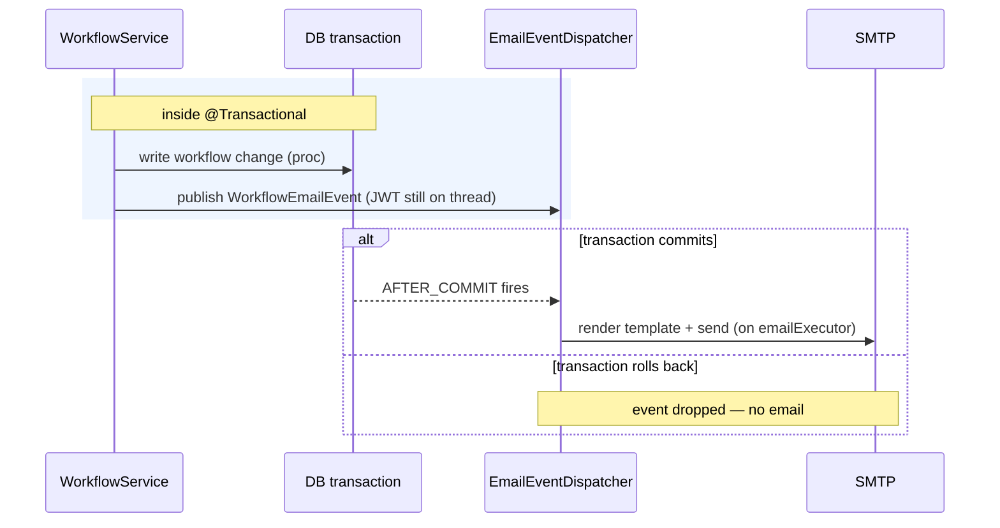

# Notifications (Email)

The `notification` package sends two distinct kinds of email. They share the
template renderer and Spring Mail (`spring-boot-starter-mail`) but are triggered
completely differently.

| Flow | Trigger | Recipients |
|------|---------|------------|
| **Workflow events** | A workflow action commits (submit, DDM decision, …) | The plan's contacts / ministry, per the legacy email ladder |
| **District-designate digest** | A scheduled cron job | IDIR users CC'd on a district's FSP submissions |

## 1. Workflow event emails (transactional)

When a workflow action mutates an FSP, an email may need to go out — but **only
if the database change actually commits.** That's the whole design constraint.

```
WorkflowService (inside @Transactional)
   └─ publishes WorkflowEmailEvent
         └─ EmailEventDispatcher  (@TransactionalEventListener, phase = AFTER_COMMIT)
               └─ EmailNotificationService → EmailTemplateRenderer → JavaMailSender
```

- `EmailEventDispatcher` listens with **`@TransactionalEventListener(AFTER_COMMIT)`**,
  so a save that rolls back never emails.
- The event is **published inside the transaction** (while the JWT is still on
  the thread) and carries everything the dispatcher needs, because dispatch
  runs after commit on a separate worker (`emailExecutor`) where the security
  context is gone.
- This mirrors the legacy `Fsp700WorkflowAction` email ladder; the
  `WorkflowEmailEvent` describes which rung fired. There's a template per
  outcome in `src/main/resources/notification/template/` — e.g.
  `fsp_decision_email`, `amendment_decision_email`, `replacement_decision_email`,
  `extension_decision_email`, `opportunity_to_be_heard_email`,
  `request_clarification_email`.



## 2. District-designate digest (scheduled batch)

District administrators can register IDIR **designates** to be CC'd on FSP
submission notifications for an org unit (the District Notification admin page).
A scheduled batch collects pending notifications and emails each designate a
digest.

```
DesignateBatchScheduler  (@Scheduled cron + @SchedulerLock)
   └─ DesignateBatchService.runOnce()
         ├─ read pending notification rows, group by designate
         ├─ resolve each designate's email   ── DesignateEmailResolver (→ FAM)
         ├─ render envelope + per-row blocks  ── EmailTemplateRenderer
         └─ send via SMTP; leave the queue intact on failure (retry next tick)
```

Key properties:

- **Opt-in + cron** — gated by `@ConditionalOnProperty fsp.notification.designate.enabled`,
  scheduled with `fsp.notification.designate.cron` (6-field Spring cron). The
  bean (and the scheduler) don't exist unless enabled.
- **One pod per firing** — `@SchedulerLock` (ShedLock) ensures that across N
  replicas, exactly one pod runs the digest per cron tick. The lock TTL is kept
  short so another pod can retry on the next tick if a run dies mid-flight.
- **At-least-once, idempotent-ish** — on an SMTP failure for a designate, that
  designate's rows are left in the queue and retried next run (so a transient
  mail outage doesn't drop notifications).
- **Email resolution** — a designate is stored as an IDIR username; the actual
  email is looked up from **FAM** at send time via `DesignateEmailResolver`
  (impl `FamDesignateEmailResolver`). See
  [fam-integration.md](fam-integration.md).
- **Crash isolation** — `runOnce()` is wrapped so one bad run can't kill the
  schedule; the next cron tick still fires.

Templates: `designate_envelope_email` (the wrapper) + `designate_block_email`
(one block per pending FSP), rendered by `EmailTemplateRenderer` from
`src/main/resources/notification/template/`.

## Package map

| Class | Role |
|-------|------|
| `DesignateBatchScheduler` | cron + ShedLock trigger |
| `DesignateBatchService` | the digest run: collect → resolve → render → send |
| `DesignateEmailResolver` / `FamDesignateEmailResolver` | IDIR → email via FAM |
| `EmailNotificationService` | publishes/sends workflow emails |
| `EmailEventDispatcher` | after-commit listener that renders + sends |
| `WorkflowEmailEvent` | the workflow email event payload |
| `EmailTemplateRenderer` | template → string |
| `NotificationConfig` | beans (mail sender, executor) |

## Operational notes

- Both flows need SMTP configured (Spring Mail `spring.mail.*`).
- The digest is **off by default**; enable it on exactly the deployment that
  should own the schedule.
- If designate emails aren't going out, check (in order): the enabled flag, the
  cron, FAM auth (the resolver logs its active auth mode at startup), and SMTP.
