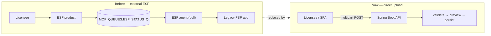

# FSP Submissions

Licensees submit Forest Stewardship Plans as a single uploaded file, in one of
two formats:

- **XML** — bare `<fsp:fspSubmission>` or ESF-wrapped, validated against the
  MOF FSP XSD (`backend/src/main/resources/schemas/fsp/`).
- **GeoJSON** — a `FeatureCollection` with an `fsp` header member and
  `fspEntityType`-tagged features. The full client-facing contract is
  [submission-geojson-spec.md](submission-geojson-spec.md).

Both formats parse into the **same** JAXB tree (`FSPSubmissionType`), so all
downstream validation, preview, and persistence run identically.

## Background: bringing ESF in-house

Historically, FSP submissions did **not** arrive over HTTP. Licensees submitted
XML through **ESF** — the BC Gov *Electronic Submission Framework*, an external
shared product that queued submissions on Oracle (`MOF_QUEUES.ESF_STATUS_Q`). A
separate ESF agent pulled XML off that queue and fed it to the legacy FSP app.
Submissions were wrapped in an `<esf:ESFSubmission>` / `<esf:submissionContent>`
envelope.

This system **replaces that intake.** The Spring Boot backend accepts the
submission **directly** as a multipart upload (`POST /submissions/validate` and
`POST /submissions`), validates and persists it itself — **no external ESF
product, no Oracle queue, no agent.** Bringing the intake in-house removes a
shared external dependency and lets validation feedback be **synchronous** (the
SPA shows errors immediately) instead of the old fire-and-forget queue model.

Backward compatibility: `submission/parser/SubmissionEnvelopeStripper` accepts
**either** the new bare `<fsp:fspSubmission>` document **or** a legacy ESF
envelope (it strips the `<esf:…>` wrappers and re-declares the namespaces on the
bare root). Everything downstream is identical, so old ESF-format XML still
uploads cleanly.



## Pipeline

```
upload ──▶ scan ──▶ detect format ──▶ parse ──▶ validate ──▶ preview ──┐
 (.xml/.json) (ClamAV)  { → GeoJSON     (XSD /     (schema +   (what we   │
                         < → XML         GeoJSON)   geometry +  parsed)    │
                                                    business)              ▼
                                                                    persist (one
                                                                    transaction)
```

- **Scan** — the raw bytes are virus-scanned (ClamAV) before anything parses
  them; an infected or (under a fail-closed policy) unverifiable file short-
  circuits to a validation error and is never parsed or stored. Attachments are
  scanned too. See [virus-scanning.md](virus-scanning.md).
- **Detect** — `SubmissionValidationService.detectFormat`: first non-whitespace
  byte `{` → GeoJSON, `<` → XML.
- **Validate (dry run)** — `POST /api/v1/fsp/submissions/validate` returns
  `valid: true` (200) or the full list of issues (422) without persisting.
  Validators cover XSD/shape, geometry validity, agreement holders, district
  codes, action-code context, licence numbers, plan term vs expiry, and FDU /
  identified-area name uniqueness.
- **Persist** — `POST /api/v1/fsp/submissions` validates again, then writes the
  FSP (header + FDUs + identified areas + stocking standards + attachments) in
  a single transaction. Geometry rings are normalized to the orientation Oracle
  Spatial requires.

Both endpoints require the **content-edit** capability (Administrator /
Submitter); see [roles-and-security.md](roles-and-security.md).

## Action codes

The submission's `actionCode` declares intent, mapped to the DB
`fsp_amendment_code`:

| `actionCode` | Meaning | DB |
|---|---|---|
| `I` | Initial — new plan | `ORG` |
| `U` | Update a draft | `ORG` |
| `A` | Amendment | `AMD` |
| `R` | Replacement | `RPL` |

For `A`/`R`, the referenced FSP must already have an approved/in-effect
amendment to build on, or the submission is rejected up front.

## Code map

| Concern | Code |
|---------|------|
| Orchestration | `submission/SubmissionValidationService` |
| Virus scanning | `service/v1/VirusScanner` + `client/ClamAvClient` ([virus-scanning.md](virus-scanning.md)) |
| XML parse | `submission/parser/SubmissionXmlParser` |
| GeoJSON parse | `submission/geojson/SubmissionGeoJsonParser` |
| Validators | `submission/validator/*` |
| Preview mapping | `submission/SubmissionPreviewMapper` |
| Persistence | `submission/persist/*` (FSP request mapper, FDU, identified areas, standards, attachments) |
| Geometry orientation | `submission/persist/GeometryOrientationNormalizer` |

Test fixtures live in `backend/src/test/resources/fixtures/submissions/` and
`frontend/e2e/fixtures/`.
